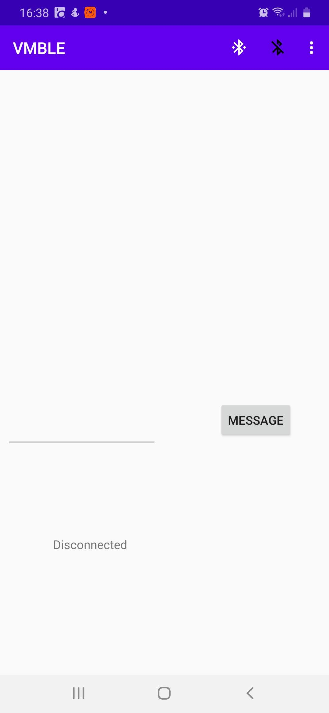
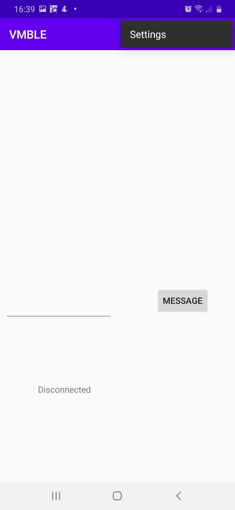
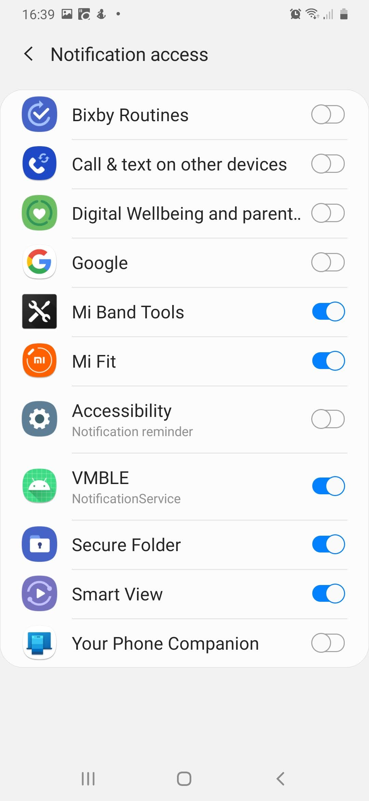
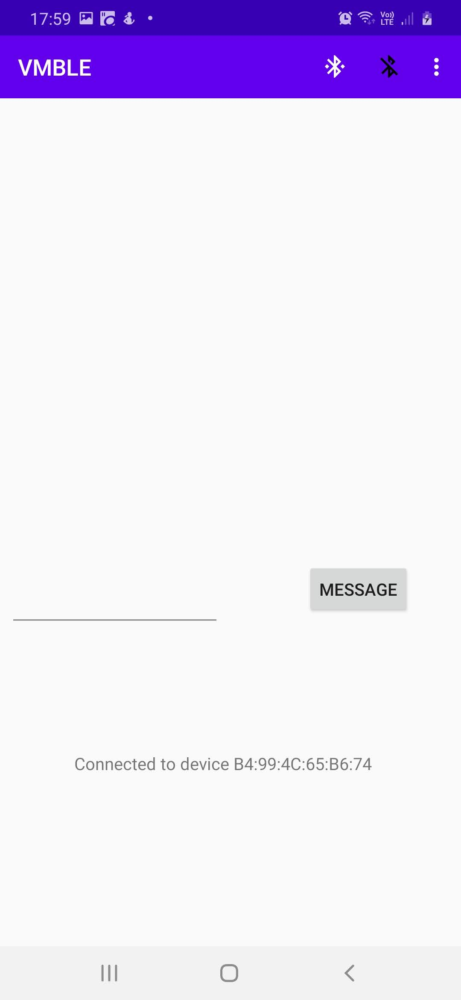

# Purpose

This application gets my phone to send notifications to my [vortex manipulator](https://github.com/RogerParkinson/vortex-manipulator)
The Vortex Manipulator is sort of a smart watch, it sits on my wrist and provides a touch screen and various apps. One of the apps
provides a list of incoming messages. This project runs on my phone and passes the notifications to the Bluetooth (BLE) interface.

It has a fairly crude UI so I can identify the actual Bluetooth device.

# Use

Just build it using Android Studio and run it on your phone. I'm testing on a Samsung A50 running Android 10. 

This is what the initial screen looks like. The two menu icons connect and disconnect respectively. On the right is the three dots icon. Press that and you'll see the 'Settings' option.

Press that Settings option and you'll see the Notification Access list like this: 

Turn on Notification Access for this application (VMBLE) or it won't be able to receive notifications. If it isn't listed there you'll need to go to Notifications in Android Settings and enable it but it will probably be there. Expect Android to raise a pop-up message asking you to confirm the change. Now go back to the main screen

When you press the white connect button you'll see a list of BLE devices.

    
Normally there is only one. Mine identifies as BT05, possibly they all do. Anyway pick it and look at the status message at the bottom which will, hopefully, tell you it is connected. At that point you can disconnect or you can send it a test message using the text widget.

Any notifications of type `msg`, `event`, `alarm`, `call` or `reminder` will now show up on the VM.

# Time

When it connects to the VM it also sends a message to tell the VM the current time. The VM clock is okay, but it drifts a bit and it doesn't have a connection to a network to sync up to. So we get the phone to send it a time update.
